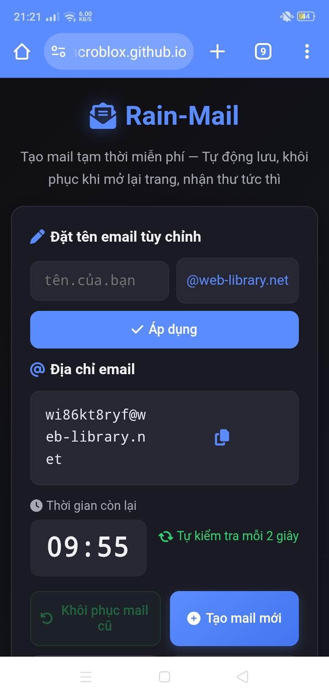

# 🌈 

# 📧 Rain-Mail

### Email tạm thời miễn phí • Ẩn danh • Không cần đăng ký

🌐 **Website:** https://hcroblox.github.io/Rain-Mail/

---

# 📖 Giới thiệu

**Rain-Mail** là dịch vụ email tạm thời được thiết kế để giúp bạn nhận email xác minh, OTP và đăng ký tài khoản trực tuyến mà không cần sử dụng email cá nhân.

Website hướng đến sự đơn giản, nhanh chóng và tôn trọng quyền riêng tư. Không cần tạo tài khoản, không thu thập thông tin cá nhân và không hiển thị quảng cáo.

---

# ✨ Tính năng

## 📧 Tạo email tức thì

- Tạo email chỉ trong vài giây.
- Không cần đăng ký.
- Sử dụng ngay sau khi tạo.

---

## ✍️ Đặt tên email tùy chỉnh

Bạn có thể:

- Tự đặt tên email theo ý muốn.
- Hoặc tạo email ngẫu nhiên.

---

## 💾 Tự động lưu

Email sẽ được lưu ngay trên trình duyệt.

Khi quay lại website, Rain-Mail sẽ tự động khôi phục địa chỉ email trước đó.

---

## 📨 Nhận thư thời gian thực

- Kiểm tra thư tự động mỗi **2 giây**
- Không cần tải lại trang
- Email mới hiển thị ngay khi nhận được

---

## ⏰ Gia hạn thời gian

- Thời gian mặc định **10 phút**
- Có thể cộng thêm thời gian
- Tối đa **60 phút**

---

## 📋 Sao chép bằng một chạm

Chỉ cần nhấn biểu tượng sao chép để copy địa chỉ email.

---

## 🌙 Giao diện hiện đại

- Dark Mode
- Thiết kế tối giản
- Mượt mà
- Dễ sử dụng

---

## 📱 Hoạt động trên mọi thiết bị

- Android
- iPhone
- Tablet
- Windows
- macOS
- Linux

---

## 🔒 Bảo mật

Rain-Mail được thiết kế để hạn chế tối đa việc lưu trữ dữ liệu.

✔ Không cần đăng ký

✔ Không lưu dữ liệu trên máy chủ

✔ Dữ liệu chỉ được lưu trong trình duyệt của bạn

✔ Hoàn toàn ẩn danh

---

## 💸 Hoàn toàn miễn phí

- Không quảng cáo
- Không thu phí
- Không Premium
- Không giới hạn sử dụng trong phạm vi dịch vụ hỗ trợ

---

# 🖼️ Giao diện Rain-Mail

<i>Giao diện thực tế của Rain-Mail trên điện thoại với chế độ tối hiện đại.</i>

---

# ⚙️ Công nghệ

- HTML5
- CSS3
- JavaScript
- Local Storage
- mail.tm API

---

# 🚀 Trải nghiệm

## https://hcroblox.github.io/Rain-Mail/

---

## ❤️ Rain-Mail

Được xây dựng với mong muốn mang đến một dịch vụ email tạm thời nhanh, miễn phí và tôn trọng quyền riêng tư.

Nếu Rain-Mail hữu ích với bạn, hãy chia sẻ cho bạn bè cùng sử dụng.

